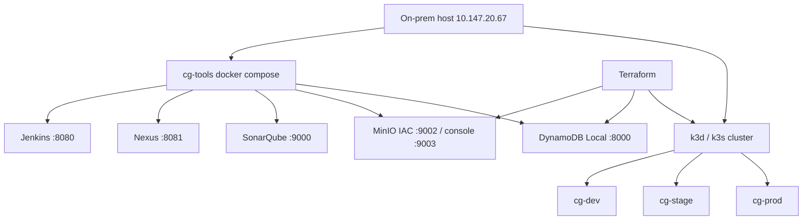
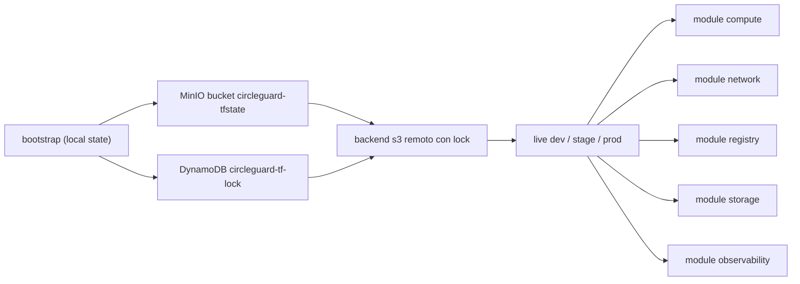
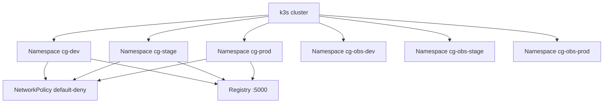

# Infrastructure diagrams

## 01 On-prem architecture

```mermaid
flowchart TB
  HOST["On-prem host 10.147.20.67"]
  TOOLS["cg-tools docker compose"]
  JENKINS["Jenkins :8080"]
  NEXUS["Nexus :8081"]
  SONAR["SonarQube :9000"]
  MINIO["MinIO IAC :9002 / console :9003"]
  DDB["DynamoDB Local :8000"]
  K3D["k3d / k3s cluster"]
  DEV["cg-dev"]
  STAGE["cg-stage"]
  PROD["cg-prod"]
  TF["Terraform"]

  HOST --> TOOLS
  TOOLS --> JENKINS
  TOOLS --> NEXUS
  TOOLS --> SONAR
  TOOLS --> MINIO
  TOOLS --> DDB
  HOST --> K3D
  K3D --> DEV
  K3D --> STAGE
  K3D --> PROD
  TF --> MINIO
  TF --> DDB
  TF --> K3D
```

## 02 Terraform flow

```mermaid
flowchart LR
  BOOT["bootstrap (local state)"] --> S3["MinIO bucket circleguard-tfstate"]
  BOOT --> LOCK["DynamoDB circleguard-tf-lock"]
  S3 --> BACKEND["backend s3 remoto con lock"]
  LOCK --> BACKEND
  BACKEND --> LIVE["live dev / stage / prod"]
  LIVE --> COMP["module compute"]
  LIVE --> NET["module network"]
  LIVE --> REG["module registry"]
  LIVE --> STO["module storage"]
  LIVE --> OBS["module observability"]
```

## 03 Networks and environments

```mermaid
flowchart TB
  K3S["k3s cluster"] --> DEV["Namespace cg-dev"]
  K3S --> STAGE["Namespace cg-stage"]
  K3S --> PROD["Namespace cg-prod"]
  K3S --> OBSDEV["Namespace cg-obs-dev"]
  K3S --> OBSSTAGE["Namespace cg-obs-stage"]
  K3S --> OBSPROD["Namespace cg-obs-prod"]
  DEV --> NP["NetworkPolicy default-deny"]
  STAGE --> NP
  PROD --> NP
  DEV --> REG["Registry :5000"]
  STAGE --> REG
  PROD --> REG
```
